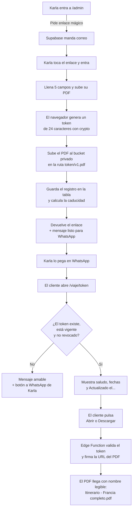

# Cómo funciona el portal de itinerarios

> Documento vivo. `CONTEXTO.md` dice **qué** y **por qué**; `PLAN-DE-TRABAJO.md` dice
> **cómo construirlo**; este dice **cómo funciona lo que ya está construido**.
> Última revisión: 2026-08-05.

---

## 1. En una frase

Karla sube su PDF, el sistema le devuelve un enlace, ella lo pega en WhatsApp, y quien
abra ese enlace ve el itinerario con la marca de la agencia y se lo puede descargar,
imprimir o guardar. Sin cuentas, sin contraseñas y sin instalar nada.

## 2. Las tres piezas

| Pieza | Dónde vive | Quién la usa |
|---|---|---|
| **Panel** `/admin` | Navegador de Karla | Solo Karla, con enlace mágico |
| **Página del itinerario** `/viaje/{token}` | Navegador del cliente | Cualquiera que tenga el enlace |
| **Supabase** | Servicio externo | Base de datos, archivos y correo de acceso |

No hay servidor propio. El navegador habla directo con Supabase, y el sitio es HTML,
CSS y JavaScript estáticos que se pueden subir a cualquier hosting.

## 3. El flujo completo



### Detalle del paso crítico: cómo se sirve el PDF

El bucket es **privado**. Nadie puede leerlo directamente, ni siquiera con la clave
publicable que va en el JavaScript. Cada vez que el cliente pulsa un botón:

1. El navegador manda el token a la Edge Function `itinerario-pdf`.
2. La función —que corre en el servidor de Supabase, con la clave de servicio que
   nunca sale de ahí— comprueba que el token existe, no está revocado y no ha caducado.
3. Solo entonces genera una URL firmada que caduca en **una hora**.

La firma se pide **al pulsar el botón, nunca al cargar la página**. Eso tiene un motivo
concreto: WhatsApp descarga la página para armar la miniatura del enlace, y si firmáramos
al cargar, esa visita automática gastaría firmas y falsearía cualquier métrica de aperturas.

## 4. Cómo está protegido

Son cuatro capas, y cada una funciona aunque fallen las otras.

| Capa | Qué impide | Comprobado |
|---|---|---|
| **El token** | 24 caracteres de `crypto.getRandomValues` (144 bits). No se adivina ni por fuerza bruta | ✅ |
| **RLS en la tabla** | Sin sesión, `select *` sobre `itinerarios` devuelve `[]`. La única lectura posible es por token exacto, vía una función | ✅ probado desde fuera con la clave publicable |
| **Bucket privado** | Sin sesión no se puede listar ni descargar. El PDF solo sale con URL firmada | ✅ el acceso directo responde 400 |
| **Registro cerrado** | Nadie puede crearse una cuenta para entrar al panel | ✅ `/auth/v1/signup` responde `signup_disabled` |

**Y un detalle que no es capa pero importa:** las etiquetas de vista previa (`og:title`)
son genéricas —*"Tu itinerario · Tierra de Viajes"*—, nunca el nombre del cliente ni el
destino. Quien vea el chat de WhatsApp por encima del hombro no se entera de nada.

### Lo que un enlace muerto no entrega

Si el itinerario está caducado o revocado, la base **ni siquiera devuelve la ruta del
archivo** (`pdf_path: null`), y la Edge Function se niega a firmar. Son dos candados
independientes para el mismo caso.

## 5. Mapa de archivos

```
public/
  index.html              la landing (ya existía)
  css/styles.css          el sistema de diseño — la fuente de verdad de la marca
  js/
    supabase-config.js    URL y clave publicable (públicas por diseño)
    comun.js              saludo y fechas, compartidos por el panel y la página

  admin/                  EL PANEL DE KARLA
    index.html            4 pantallas: cargando, acceso, correo enviado, panel
    css/admin.css         extiende styles.css; no define ni un color nuevo
    js/sesion.js          enlace mágico y sesión
    js/panel.js           alta de itinerarios
    js/vendor/supabase.js copia local de la librería (206 KB)

  viaje/                  LA PÁGINA DEL CLIENTE
    index.html            itinerario + los tres finales tristes
    css/viaje.css         incluye el @media print con el QR
    js/viaje.js           lee el token, pinta y pide las firmas
    js/vendor/qrcode.js   generador de QR (57 KB)
    .htaccess             reescritura para la URL limpia (solo aplica en Apache)

supabase/
  migrations/             las 3 migraciones aplicadas, en SQL
  functions/itinerario-pdf/   la Edge Function que firma
  plantillas-correo/      el correo de acceso en español
```

> Las migraciones están en el repositorio a propósito. El proyecto de Supabase vive en
> una cuenta personal y no se va a transferir, así que este SQL es el único respaldo
> reproducible del esquema.

## 6. Por qué el peso importa aquí

La página del cliente se abre desde un celular, a veces en el extranjero y con mala
señal. Por eso **no carga la librería de Supabase**: para leer un itinerario basta un
`fetch`, y así la página pesa unos 23 KB de código propio en vez de 230 KB.

El panel sí la carga, porque necesita sesión y subida de archivos con reintentos — y lo
abre Karla desde su casa, no desde un pueblo sin señal.

Las dos librerías de terceros están **copiadas dentro del repositorio**, no enlazadas a
un CDN. Así el portal no depende de que un servicio ajeno siga en pie, y nadie puede
cambiar mañana el código que corre en el navegador de Karla o de sus clientes.

## 7. Decisiones tomadas durante la construcción

Estas no estaban en el plan original; salieron al construir.

| Decisión | Por qué |
|---|---|
| Edge Function para firmar el PDF | El navegador del cliente no puede hacerlo sin poder listar todo el bucket (§2.7 del plan) |
| Token de 24 caracteres, no 21 | El plan pedía 21 como mínimo; 24 sale gratis |
| Ruta del PDF `{token}/v{n}.pdf` | Deja sitio para versionar al reemplazar el archivo, sin pisar el anterior |
| Si falla el guardado, se borra el PDF subido | Un archivo sin registro es basura invisible que nadie va a encontrar nunca |
| El saludo usa el nombre de pila | *"¡Hola Alicia!"* suena a Karla; *"¡Hola Alicia Ocampo Ramírez!"* suena al banco. Excepción: si el nombre lleva "y" se deja completo, para no dejar fuera a nadie |
| Tope de 25 MB en el bucket, aviso desde 8 MB | Un PDF pesado se descarga fatal con datos móviles en el extranjero |
| Fechas con hora fija de mediodía | Sin eso, el huso horario corre las fechas un día hacia atrás |

## 8. Lo que todavía no existe

- **Lista de itinerarios en el panel** (Paso 4): hoy Karla puede crear, pero no ver lo
  que creó, ni recopiar un enlace, ni revocar, ni reactivar.
- **Botón de calendario** (Paso 6).
- **Registro de última apertura** (Paso 7).
- **Aviso de actualización al reemplazar el PDF** (Paso 7).
- **SMTP propio**: sin esto Karla no puede entrar en producción. Ver
  `PUESTA-EN-PRODUCCION.md`.

## 9. Deudas conocidas

Cosas que funcionan pero convendría mejorar. Se anotan para que no se olviden.

1. **Cualquier usuario autenticado puede leer y escribir todos los itinerarios.**
   Hoy no es un problema porque solo existe la cuenta de Karla y el registro está
   cerrado. Si algún día se añade una segunda persona, habría que acotar las políticas
   por usuario en vez de dar acceso a todo el rol `authenticated`.
2. **No hay pruebas automatizadas.** Todo se ha verificado a mano, paso por paso, en el
   navegador. Para un proyecto de este tamaño es defendible, pero conviene saberlo.
3. **La cuenta de Karla tendrá contraseña aunque nunca se use.** El panel entra solo por
   enlace mágico, pero si la cuenta se crea con contraseña, esa contraseña sigue
   sirviendo para entrar por la API. Lo limpio es crear la cuenta sin contraseña.
4. **Al borrar un itinerario habrá que borrar también su PDF.** El borrado todavía no
   existe (llega en el Paso 4); cuando se construya, tiene que limpiar las dos cosas.
